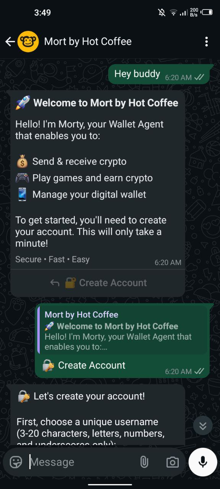
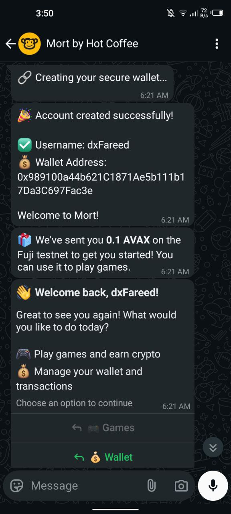
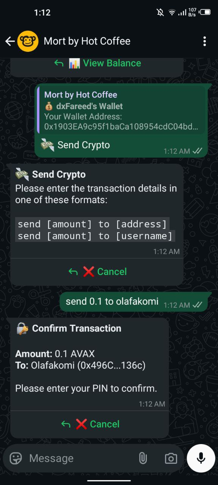
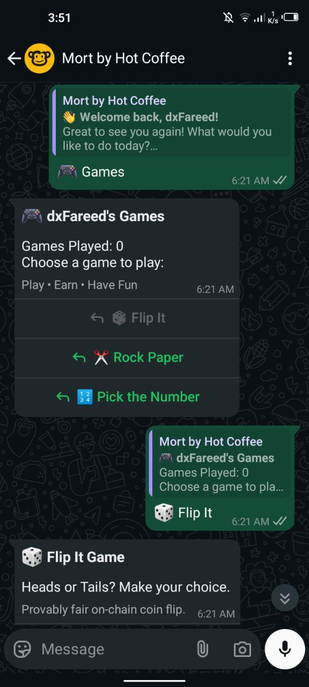
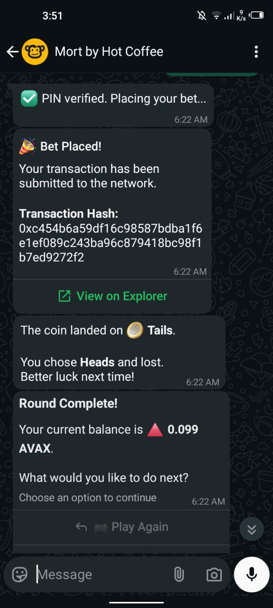
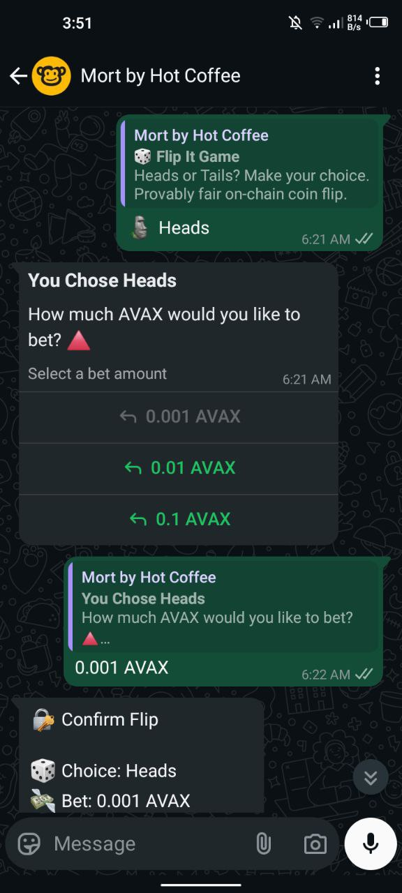

# 🚀 Mort - The WhatsApp Web3 Wallet & Gaming Platform

**Mort is a WhatsApp bot that brings the power of Web3 to the world's most popular messaging app. We solve crypto's biggest problem—terrible user experience by allowing anyone to create a wallet on Avalanche, send and receive tokens, and play provably fair onchain games, all through a text message.**

No browser extensions. No seed phrases to manage. No confusing websites. Just WhatsApp.

**Try the Live Demo on WhatsApp:** [**wa.me/message/NZE2L3J66OL4D1**](https://wa.me/message/NZE2L3J66OL4D1)

**Track:** onChain Finance and Avalanche

```js
// Deployed & Verfied contracts on Avalanche fuji.

FLIP_GAME_CONTRACT_ADDRESS = "0x2080fA690Adbe5aBd30EB1BebBE9D422AC8C1b5F"
RPS_GAME_CONTRACT_ADDRESS = "0x645022899f2dC8823938a2D64500aeb67f13F08a"
LUCKY_NUMBER_GAME_CONTRACT_ADDRESS = "0xCB7e86de61d03345e265263EA73c4cE3E7e1412a"
```

---


## The Problem We Solve

The single biggest barrier to crypto adoption is its complexity. Our bot bridges the gap between the hostile world of Web3 and the familiar simplicity of Web2.

-   **For Traditional Users:** We eliminate the need to install wallets or manage seed phrases. Your wallet is created instantly and securely behind the scenes via Privy. Sending crypto is as easy as texting <br/> `send 0.1 to @username`.
-   **For Crypto Natives:** We provide a guarantee of fairness that traditional gaming platforms can't match. All game logic is executed onchain, and we use **Chainlink VRF** as our trust engine for provably fair, verifiable randomness.

We've taken the transparency of Web3 and delivered it with the simplicity of a chat app.


## Features

-   **Instant Wallet Creation:** Onboard new users in seconds with an embedded wallet.
<br/>



- **Seamless Payments:** Send crypto to other users via simple text.
<br/>


-   **Provably Fair Games:** A suite of onChain games with randomness secured by Chainlink VRF.
<br/>



-   **Conversational UX:** All interactions are handled through a natural, message-based flow.
<br/>


## Games & Payouts

Our games are designed to be simple, fair, and transparent. All payouts and fees are calculated onchain.

### 1. Coin Flip

A classic 50/50 game of chance.

-   **How to Play:** Choose "Heads" or "Tails".
-   **Payout:** A winning bet receives a **1.92x** payout (e.g., a 0.1 AVAX bet returns 0.192 AVAX).
-   **House Edge:** 4%. This is split between a house fee (2.5%) and an admin fee (1.5%).

### 2. Rock, Paper, Scissor

The timeless strategy game, now onChain.

-   **How to Play:** Choose Rock, Paper, or Scissor.
-   **Payout:**
    -   **Win:** **1.92x** payout.
    -   **Draw:** Your original bet is returned to you.
-   **House Edge:** 4% on winning outcomes only. Split between a house fee (2.5%) and an admin fee (1.5%).

### 3. Pick the Lucky Number

Our flagship game demonstrating a two-step, asynchronous onchain interaction.

-   **How to Play:**
    1.  Place a bet to start the game. The bot will send you 5 unique random numbers.
    2.  Reply with the number you think is the lucky one.
-   **Payout:** The game has a 1-in-5 chance of winning. A correct guess receives a **4.8x** payout on the original bet.
-   **House Edge:** 4% of the total prize pool. This is derived from the difference between the true 5x odds and the 4.8x payout, and is split between a house fee (2.4%) and an admin fee (1.6%).

---

## Quick Start & Setup

### File Architecture

The project is structured as a monorepo with two main packages:

```
mort/
├── smart_contract/       # Solidity contracts & deployment scripts
│   ├── contracts/        # Game contracts (FlipGame, RPSGame, LuckyNumberGame)
│   ├── scripts/          # Deployment scripts
│   └── hardhat.config.js # Hardhat configuration
├── backend/              # Node.js backend with Express & WhatsApp logic
│   ├── index.js          # Main server file
│   └── abi/              # Contract ABIs
└── README.md
```

### 1. Deploy the Smart Contracts

First, you need to deploy the contracts to the Avalanche Fuji Testnet.

-   **Navigate to the `smart_contract` directory:**
    ```bash
    cd mort/smart_contract
    ```

-   **Install dependencies:**
    ```bash
    npm install
    ```

-   **Create your environment file.** Create a `.env` file in the `smart_contract/` directory and populate it with your credentials. You will need a funded wallet's private key and an RPC URL from a provider like Alchemy.
    ```env
    ALCHEMY_FUJI_URL="YOUR_ALCHEMY_FUJI_RPC_URL"
    PRIVATE_KEY="YOUR_WALLET_PRIVATE_KEY"
    VRF_COORDINATOR="0x5C210eF41CD1a72de73bF76eC39637bB0d3d7BEE"
    KEY_HASH="0xc799bd1e3bd4d1a41cd4968997a4e03dfd2a3c7c04b695881138580163f42887"
    SUB_ID="YOUR_CHAINLINK_VRF_SUBSCRIPTION_ID"
    ```

-   **Deploy the contracts:**
    ```bash
    # Flip Game
    npx hardhat run scripts/deployFlip.js --network fuji

    # RPS (Rock, paper, scissors) Game
    npx hardhat run scripts/deployRPS.js --network fuji

    # Lucky Number Game
    npx hardhat run scripts/deployGuessNum.js --network fuji
    ```
    After deployment, the script will print the addresses of your new contracts. **Copy these addresses.**

### 2. Set Up the Backend Bot

Next, configure and run the Node.js server that powers the WhatsApp bot.

-   **Navigate to the `backend` directory:**
    ```bash
    cd ../backend
    ```

-   **Install dependencies:**
    ```bash
    npm install
    ```

-   **Create your environment file.** Create a `.env` file in the `backend/` directory and populate it with your credentials.
    ```env
    # --- WhatsApp & Privy ---
    WHATSAPP_TOKEN=
    WHATSAPP_HOOK_TOKEN=
    PRIVY_SIGNING_KEY=
    PRIVY_CLIENT_ID=
    PRIVY_APP_ID=
    PRIVY_APP_SECRET=
    PORT=8000
    
    
    # --- Blockchain & API Services ---
    COINGECKO_API=
    COINGECKO_API_KEY=
    AVAX_RPC_WSS_URL=wss://avalanche-fuji.drpc.org # get your own rpc url from https://www.alchemy.com

    FLIP_GAME_CONTRACT_ADDRESS="PASTE_ADDRESS_FROM_DEPLOYMENT"
    RPS_GAME_CONTRACT_ADDRESS="PASTE_ADDRESS_FROM_DEPLOYMENT"
    LUCKY_NUMBER_GAME_ADDRESS="PASTE_ADDRESS_FROM_DEPLOYMENT"
    ```
    **Important:** Paste the contract addresses you copied from the deployment step.

-   **Run the bot:**
    ```bash
    npm start
    ```
### 3. Connect to WhatsApp
    Your local server needs to be accessible from the internet for the WhatsApp API to send messages to it.
-   **Expose your local server.** We recommend using ngrok. Open a new terminal and run:
        ```bash
        ngrok http 8000
        ```

    ngrok will give you a public "Forwarding" URL (e.g., https://1234-56-78-90.ngrok-free.app). Copy this URL.
    **Configure the Webhook.**
    1. Go to your app in the **Meta for Developers** dashboard.
    2. Navigate to WhatsApp > Configuration.
    3. In the "Webhook" section, click "Edit".
    4. Paste your ngrok URL into the Callback URL field, and be sure to add /webhook at the end. It should look like this: https://1234-56-78-90.ngrok-free.app/webhook.
    5. Enter the WHATSAPP_HOOK_TOKEN from your .env file into the **Verify token** field.
    6. Save and subscribe to the messages webhook field.


Your bot is now live and connected to your newly deployed smart contracts on the Avalanche Fuji network!

---

**Join the Waitlist:** [**https://mort-frontend-plsz.vercel.app/**](https://mort-frontend-plsz.vercel.app/)